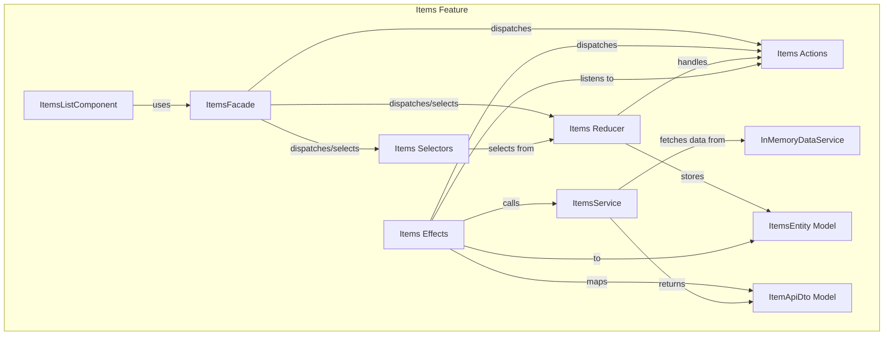

# Items Feature

## Diagram
this is a diagram

```mermaid
graph TD
  subgraph Items Feature
    A[ItemsListComponent]
    B[ItemsFacade]
    C[ItemsService]
    D[Items Reducer]
    E[Items Effects]
    F[Items Selectors]
    G[Items Actions]
    H[ItemsEntity Model]
    I[ItemApiDto Model]
    J[InMemoryDataService]
  end

  %% Component to Facade
  A -->|uses| B

  %% Facade to Store and Service
  B -->|dispatches/selects| D
  B -->|dispatches/selects| F
  B -->|dispatches| G

  %% Service to API/Mock
  C -->|fetches data from| J

  %% Effects to Service and Actions
  E -->|calls| C
  E -->|dispatches| G

  %% Reducer and Effects use Actions
  D -->|handles| G
  E -->|listens to| G

  %% Reducer uses Entity Model
  D -->|stores| H

  %% Effects map API DTO to Entity
  E -->|maps| I
  E -->|to| H

  %% Service returns API DTO
  C -->|returns| I

  %% Selectors select from Reducer
  F -->|selects from| D
```
